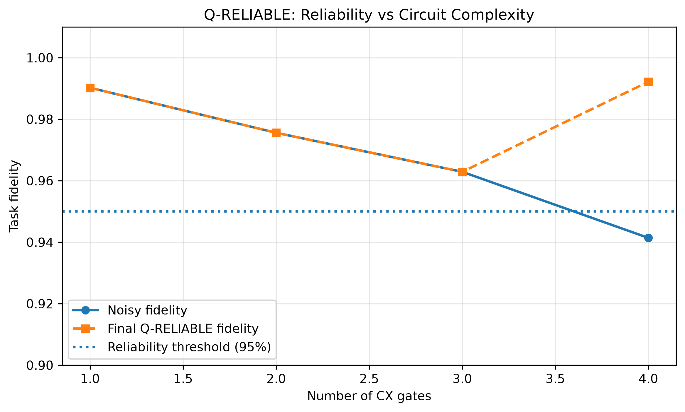
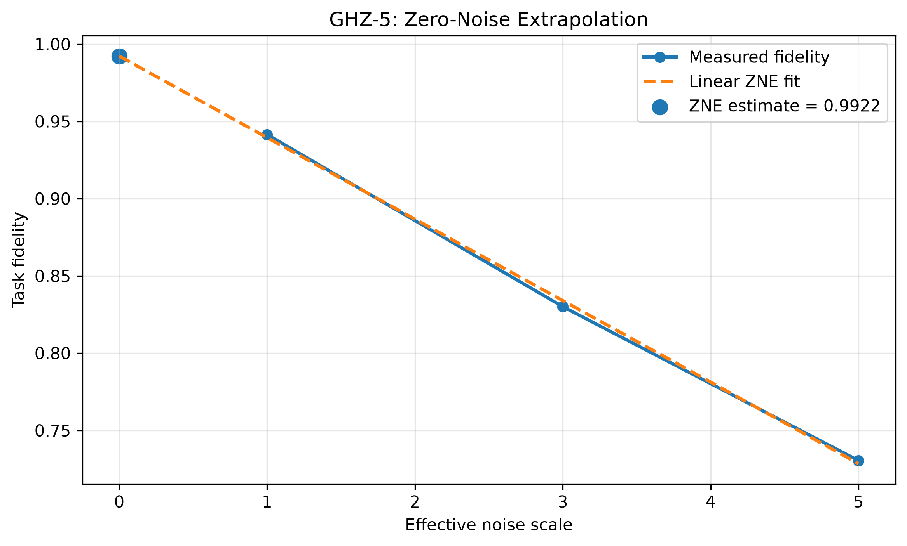
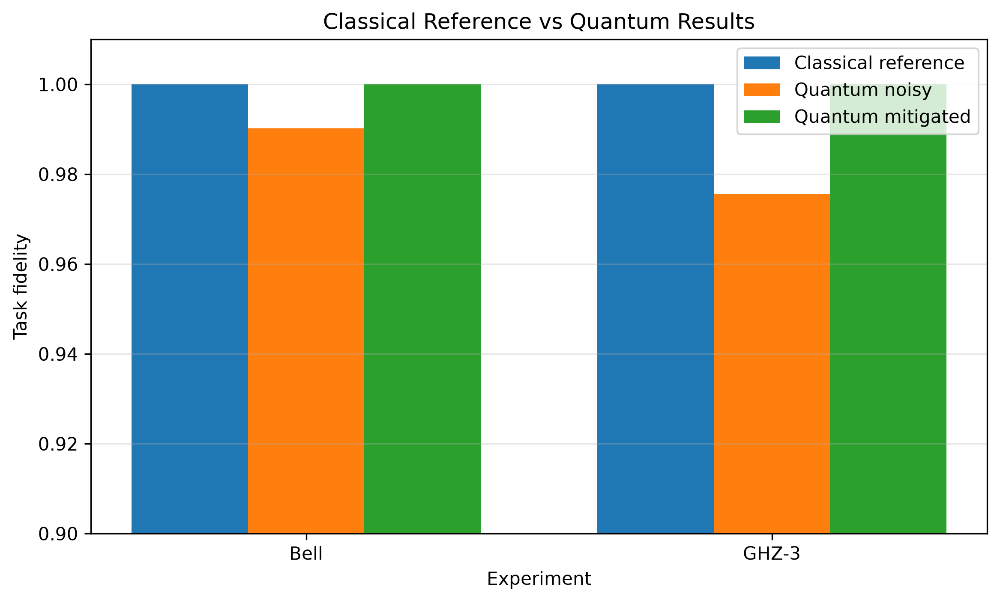

# Q-RELIABLE

### Noise-Aware Reliability Engineering for Quantum Circuits

Q-RELIABLE is a Qiskit-based noise-aware quantum reliability workflow designed to evaluate how circuit complexity affects task-level fidelity and automatically determine when mitigation should be applied.

Instead of blindly applying mitigation to every circuit, Q-RELIABLE follows an engineering workflow:

**Circuit Characterization → Controlled Noise Injection → Reliability Measurement → Mitigation Decision → ZNE Mitigation → Reliability Report**

---

## 1. Problem Statement

Quantum circuits executed on noisy quantum hardware or realistic simulators can produce results that deviate from their expected outcomes.

A practical quantum software engineer therefore needs to answer:

- How sensitive is a circuit to noise?
- How does circuit complexity affect reliability?
- When should mitigation be applied?
- Does mitigation actually improve the result?
- What is the measurement overhead of mitigation?

Q-RELIABLE addresses these questions using a controlled Qiskit Aer noise model and a configurable reliability threshold.

---

## 2. Key Idea

Q-RELIABLE treats quantum error mitigation as a **reliability engineering problem** rather than simply applying mitigation blindly.

The workflow is:

```text
Input Circuit
     ↓
Circuit Analyzer
     ↓
Circuit + Noise Metrics
     ↓
Reliability Score
     ↓
Is Fidelity < Threshold?
    /              \
  No                Yes
  │                  │
  ▼                  ▼
Keep Result       Apply ZNE
  │                  │
  └────────┬─────────┘
           ▼
    Final Reliability
           │
           ▼
    Reliability Report
```

---

## 3. Implementation

### Technology Stack

- Python 3.11
- Qiskit 2.5.2
- Qiskit Aer 0.17.2
- NumPy 2.4.6
- Pandas 3.0.6
- Matplotlib 3.11.2

### Quantum Circuits

The project evaluates:

- Bell state circuit
- GHZ-3 circuit
- GHZ-4 circuit
- GHZ-5 circuit

The circuits progressively increase in the number of two-qubit CX gates, allowing controlled investigation of circuit complexity and reliability.

---

## 4. Controlled Noise Model

The experiments use a synthetic Qiskit Aer noise model.

A 2% depolarizing error is applied to CX gates.

```python
NOISE_PROBABILITY = 0.02
```

The noise model is intentionally controlled so that the effect of increasing two-qubit-gate complexity can be measured consistently.

> This is a simulation model, not a claim about the physical error rate of a particular quantum processor.

---

## 5. Reliability Metric

Q-RELIABLE uses **task-level fidelity** for the selected experiments.

For the Bell state, the expected outcomes are `00` and `11`.

For GHZ circuits, the expected outcomes are `000...0` and `111...1`.

The metric is:

```text
Fidelity = Number of expected outcomes / Total shots
```

> This is a task-level measurement fidelity, not full quantum-state fidelity.

---

## 6. Automatic Mitigation Decision

The configured reliability threshold is **0.95 (95%)**.

```text
If fidelity >= 0.95 → NO_MITIGATION
If fidelity < 0.95  → MITIGATE
```

The threshold is a prototype engineering parameter and is not intended to be a universal reliability threshold for quantum hardware.

---

## 7. Zero-Noise Extrapolation

When mitigation is required, Q-RELIABLE applies a simple Zero-Noise Extrapolation (ZNE) workflow.

The effective noise scales used are:

- 1×
- 3×
- 5×

The measured fidelities are fitted using a linear model and extrapolated toward zero noise.

The project reports both the raw ZNE extrapolation and the physically bounded value in the range [0, 1].

---

## 8. Experimental Results

| Circuit | CX Gates | Noisy Fidelity | Decision | Final Fidelity |
|---|---:|---:|---|---:|
| Bell | 1 | 99.0234% | NO_MITIGATION | 99.0234% |
| GHZ-3 | 2 | 97.5586% | NO_MITIGATION | 97.5586% |
| GHZ-4 | 3 | 96.2891% | NO_MITIGATION | 96.2891% |
| GHZ-5 | 4 | 94.1406% | MITIGATE | 99.2187% |

### GHZ-5 result

- Before mitigation: **94.1406%**
- After ZNE: **99.2187%**
- Absolute improvement: **5.0781 percentage points**
- ZNE shot budget: **3× baseline**

---

## 9. Results

### Reliability vs Circuit Complexity



The controlled experiment shows decreasing task-level fidelity as the number of CX gates increases. Under the selected noise model, GHZ-5 crosses the configured reliability threshold and triggers mitigation.

### GHZ-5 Zero-Noise Extrapolation



The measured fidelity decreases as the effective noise scale increases. Linear extrapolation estimates the zero-noise fidelity.

### Classical Reference Comparison



The classical reference represents an ideal-output correctness baseline for the selected Bell and GHZ tasks.

> This is not a runtime or computational-performance comparison and does not claim quantum advantage.

---

## 10. Engineering Insights

1. Increasing CX-gate complexity can reduce task-level fidelity under noise.
2. A reliability threshold can be used to trigger mitigation automatically.
3. Mitigation should not necessarily be applied to every circuit.
4. ZNE can recover a significant portion of the observed error in the GHZ-5 experiment.
5. Mitigation introduces additional measurement cost.
6. Reliability and mitigation effectiveness should be reported together with their overhead.

---

## 11. Limitations

- Results are simulator-based.
- No real IBM Quantum hardware result is claimed.
- The 2% depolarizing parameter is synthetic.
- The 95% threshold is configurable and illustrative.
- Task-level fidelity is not full state fidelity.
- ZNE is demonstrated as an engineering technique rather than proposed as a novel algorithm.
- The classical comparison is an ideal-output reference rather than a computational-speed benchmark.
- No claim of quantum advantage is made.

---

## 12. Reproducibility

Clone the repository:

```bash
git clone <YOUR_GITHUB_REPOSITORY_URL>
cd Quantum-RELIABLE
```

Create the environment:

```bash
conda create -n q-reliable python=3.11
conda activate q-reliable
```

Install the tested dependencies:

```bash
pip install -r requirements.txt
```

Launch Jupyter:

```bash
jupyter notebook
```

Open `Q_RELIABLE_Phase1_Bell_Noise.ipynb` and run the notebook from top to bottom.

---

## 13. Project Structure

```text
Quantum-RELIABLE/
│
├── Q_RELIABLE_Phase1_Bell_Noise.ipynb
├── requirements.txt
├── README.md
│
└── results/
    ├── reliability_vs_complexity.png
    ├── zne_ghz5.png
    └── classical_vs_quantum.png
```

---

## 14. Conclusion

Q-RELIABLE demonstrates a practical noise-aware engineering workflow for quantum circuits.

Rather than assuming mitigation is always beneficial, the system:

**Characterizes → Measures → Decides → Mitigates → Reports**

This makes reliability, mitigation benefit, and measurement overhead visible to the quantum software engineer.

The current implementation is a simulator-based proof of concept designed to be extended to additional noise models, hardware backends, circuit families, and mitigation techniques.

---

## 15. Hackathon Alignment

**Challenge:** I7 — Noise-Aware Engineering

**Role:** Quantum Software Engineer

**Primary Qiskit components:**

- Qiskit QuantumCircuit
- Qiskit transpilation
- Qiskit AerSimulator
- Qiskit Aer noise models
- Depolarizing errors
- Zero-Noise Extrapolation workflow